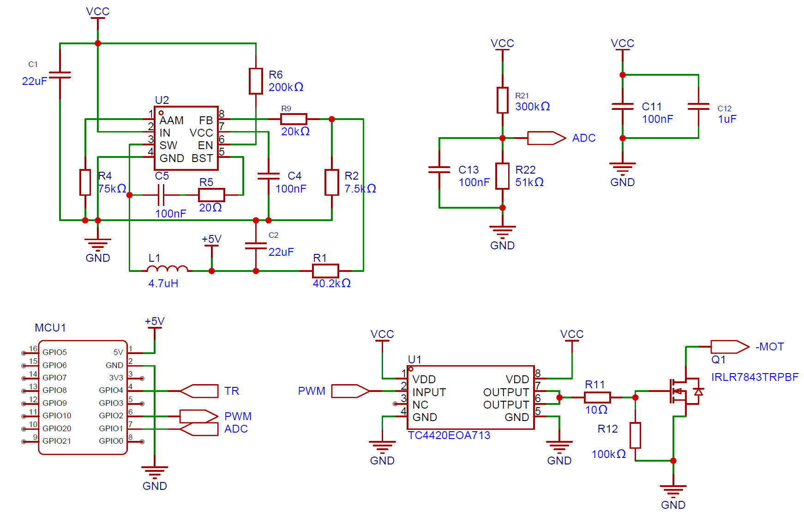
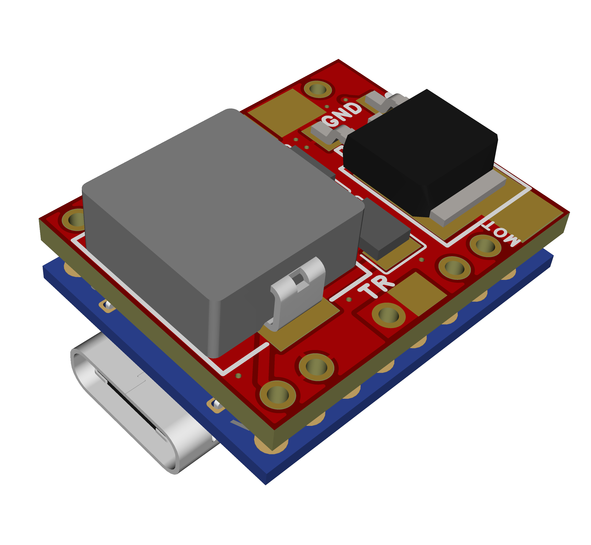
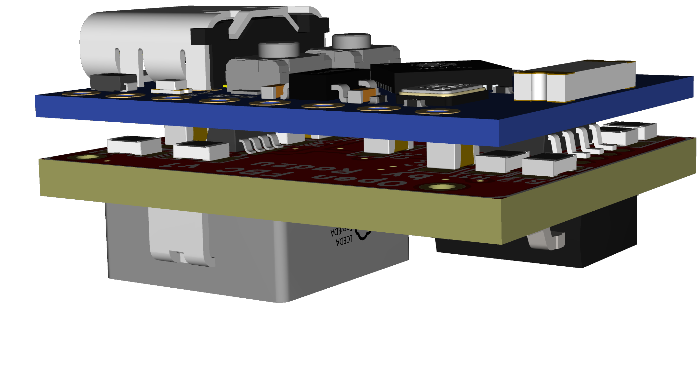
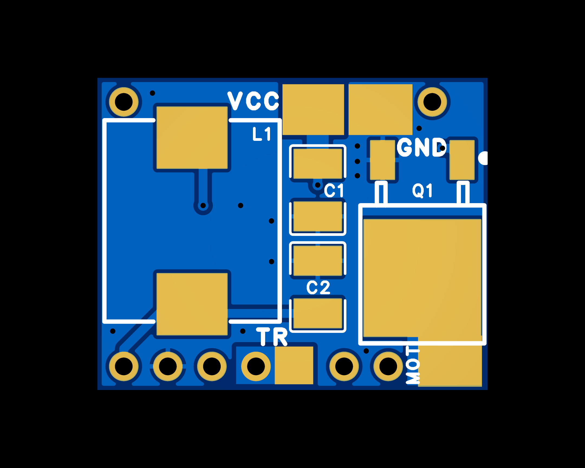
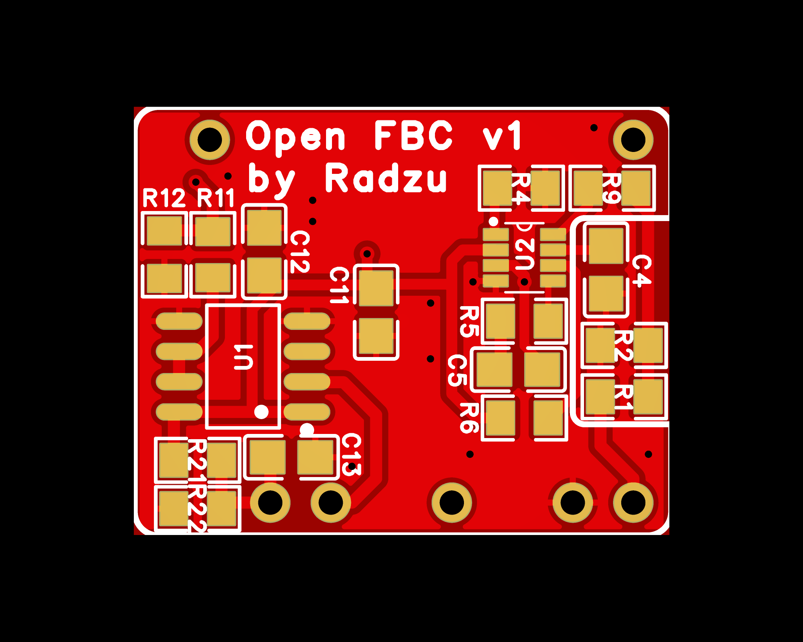

# OpenFBC PowerBoard v1 — Dokumentacja sprzętowa / Hardware Documentation

## Szybka nawigacja / Quick Navigation

### PL
- [Opis](#opis)
- [Bloki funkcjonalne](#bloki-funkcjonalne)
- [Schemat](#schemat)
- [Diagram połączeń](#diagram-połączeń)
- [Pliki produkcyjne](#pliki-produkcyjne)
- [Lista elementów (BOM)](#lista-elementów-bom)
- [Wizualizacje PCB](#wizualizacje-pcb)
- [Uwagi montażowe](#uwagi-montażowe)

### EN
- [Overview](#overview)
- [Functional Blocks](#functional-blocks)
- [Schematic](#schematic)
- [Wiring Diagram](#wiring-diagram)
- [Production Files](#production-files)
- [Bill of Materials (BOM)](#bill-of-materials-bom)
- [PCB Visualisations](#pcb-visualisations)
- [Assembly Notes](#assembly-notes)

---

# PL

## Opis

PowerBoard v1 to kompaktowa płytka rozszerzająca zaprojektowana do współpracy z modułem **ESP32-C3 Super Mini**, montowanym za pomocą goldpinów 2.54 mm. Całość tworzy zwartą konstrukcję o obrysie zbliżonym do samego modułu ESP32, dzięki czemu układ można łatwo zintegrować w ograniczonej przestrzeni obudowy.

Aby ograniczyć wymiary, elementy zostały rozmieszczone po **obu stronach PCB**. Płytka integruje sekcję zasilania 5 V, układ sterowania silnikami szczotkowymi przez PWM, wejście spustu oraz tor pomiaru napięcia pakietu LiPo.

Założony zakres zasilania to **LiPo 2S–4S**, przy czym domyślna konfiguracja firmware zakłada pakiet 3S.

## Bloki funkcjonalne

| Blok | Główne elementy | Opis |
|---|---|---|
| Przetwornica 5 V | MP2315, L1, R1–R9, C1, C2, C4, C5, C11, C12 | Obniżenie napięcia pakietu LiPo do 5 V dla zasilania modułu ESP32 i drivera bramki |
| Driver bramki MOSFET | TC4420, R11, R12 | Szybkie sterowanie bramką tranzystora mocy przy pracy PWM |
| Stopień mocy silników | IRLR7843 | Tranzystor N-MOSFET przełączający masę dwóch silników połączonych równolegle |
| Pomiar napięcia baterii | R21, R22, C13 | Dzielnik rezystorowy z kondensatorem filtrującym do pomiaru napięcia pakietu przez ADC |
| Wejście spustu | Pad lutowniczy | Wejście aktywowane zwarciem do masy, przeznaczone do podłączenia przewodu od spustu |

### Tor pomiaru napięcia baterii

Dzielnik został dobrany tak, aby był bezpieczny i kompatybilny z układami **ESP32-C3**, **ESP32-C6** oraz **ESP32-S3**:

- **R21 = 300 kΩ**
- **R22 = 51 kΩ**
- **C13 = 100 nF**
- Współczynnik dzielnika: `(300 + 51) / 51 = 6.882`
- Napięcie na wejściu ADC przy **4S pełne (16.8 V):** około **2.44 V**
- Napięcie na wejściu ADC przy **3S pełne (12.6 V):** około **1.83 V**
- Stała firmware: `BATTERY_DIVIDER_RATIO 6.882f`

## Schemat

## Diagram połączeń

## Pliki produkcyjne

| Plik | Opis |
|---|---|
| [`Gerber_PCB1_2026-05-28.zip`](Gerber_PCB1_2026-05-28.zip) | Paczka Gerber gotowa do bezpośredniego złożenia zamówienia na PCB |

Domyślne parametry zamówienia dla typowych fabryk PCB: 2 warstwy, FR4 1.6 mm, HASL, standardowa maska lutownicza.

## Lista elementów (BOM)

Wszystkie elementy SMD mają obudowę **0805**, chyba że wskazano inaczej.

| Ref | Wartość | Opis | Obudowa | Ilość |
|---|---|---|---|---|
| C1, C2 | 22 µF | Kondensatory filtrujące przetwornicy | C1210 | 2 |
| C4, C5, C11, C13 | 100 nF | Kondensatory odsprzęgające / filtr ADC | C0805 | 4 |
| C12 | 1 µF | Kondensator pomocniczy | C0805 | 1 |
| L1 | 4.7 µH | Dławik przetwornicy buck | IND 11.6×10.1 mm | 1 |
| R1 | 40.2 kΩ | Sieć sprzężenia zwrotnego przetwornicy | R0805 | 1 |
| R2 | 7.5 kΩ | Sieć sprzężenia zwrotnego przetwornicy | R0805 | 1 |
| R4 | 75 kΩ | Element pomocniczy przetwornicy | R0805 | 1 |
| R5 | 20 Ω | Element pomocniczy przetwornicy | R0805 | 1 |
| R6 | 200 kΩ | Element pomocniczy przetwornicy | R0805 | 1 |
| R9 | 20 kΩ | Element pomocniczy przetwornicy | R0805 | 1 |
| R11 | 10 Ω | Rezystor szeregowy bramki MOSFET | R0805 | 1 |
| R12 | 100 kΩ | Rezystor pull-down bramki MOSFET | R0805 | 1 |
| R21 | 300 kΩ | Górny rezystor dzielnika napięcia baterii | R0805 | 1 |
| R22 | 51 kΩ | Dolny rezystor dzielnika napięcia baterii | R0805 | 1 |
| Q1 | IRLR7843 | Tranzystor N-MOSFET mocy | TO-252-2 | 1 |
| U1 | TC4420 | Driver bramki MOSFET | SOP-8 | 1 |
| U2 | MP2315 | Synchroniczna przetwornica buck 3 A | TSOT23-8 | 1 |
| MCU1 | ESP32-C3 Super Mini | Moduł mikrokontrolera, montowany na goldpinach | ESP32-C3 SM | 1 |

**Uwagi:**
- Goldpiny 2.54 mm nie są ujęte w BOM — zwykle są dołączane do modułu ESP32-C3 Super Mini.
- Połączenia zasilania, silników i spustu są realizowane przez bezpośrednie przylutowanie przewodów do padów PCB.
- Dodatkowe elementy mechaniczne i złącza nie są przewidziane w projekcie, aby utrzymać możliwie małe wymiary płytki.

## Wizualizacje PCB

### Widok 3D

### Widok 2D

| Top | Bottom |
|:---:|:---:|
|  |  |

## Uwagi montażowe

- Zalecane jest rozpoczęcie montażu od elementów SMD po stronie dolnej, a następnie po stronie górnej.
- Moduł **ESP32-C3 Super Mini** nie jest lutowany bezpośrednio do płytki — jest osadzany na goldpinach 2.54 mm.
- Przewody zasilania, silników oraz spustu należy lutować bezpośrednio do odpowiednich padów na PCB.
- Wejście spustu jest aktywne po zwarciu do GND.
- Po zakończeniu montażu należy zweryfikować obecność stabilnego napięcia 5 V przed osadzeniem modułu ESP32.

---

# EN

## Overview

PowerBoard v1 is a compact expansion board designed to work with the **ESP32-C3 Super Mini**, mounted using standard 2.54 mm pin headers. The assembly forms a compact stack with an outline close to the ESP32 module itself, making it suitable for installations with limited internal space.

To minimise the overall footprint, components are placed on **both sides of the PCB**. The board integrates a 5 V power supply stage, PWM motor control circuitry, trigger input and LiPo battery voltage sensing.

The intended supply range is **LiPo 2S–4S**, while the default firmware configuration assumes a 3S pack.

## Functional Blocks

| Block | Main Components | Description |
|---|---|---|
| 5 V Buck Regulator | MP2315, L1, R1–R9, C1, C2, C4, C5, C11, C12 | Steps LiPo battery voltage down to 5 V for ESP32 and gate driver supply |
| MOSFET Gate Driver | TC4420, R11, R12 | Provides fast gate drive for PWM operation |
| Motor Power Stage | IRLR7843 | N-channel MOSFET switching the low side of two motors connected in parallel |
| Battery Voltage Measurement | R21, R22, C13 | Resistive divider with filter capacitor for ADC battery monitoring |
| Trigger Input | Solder pad | Active-low input intended for direct wiring to the trigger circuit |

### Battery Voltage Sensing

The divider was selected to ensure safe operation and compatibility with **ESP32-C3**, **ESP32-C6** and **ESP32-S3** devices:

- **R21 = 300 kΩ**
- **R22 = 51 kΩ**
- **C13 = 100 nF**
- Divider ratio: `(300 + 51) / 51 = 6.882`
- ADC input voltage at **4S full charge (16.8 V):** approximately **2.44 V**
- ADC input voltage at **3S full charge (12.6 V):** approximately **1.83 V**
- Firmware constant: `BATTERY_DIVIDER_RATIO 6.882f`

## Schematic

## Wiring Diagram

## Production Files

| File | Description |
|---|---|
| [`Gerber_PCB1_2026-05-28.zip`](Gerber_PCB1_2026-05-28.zip) | Gerber package ready for direct PCB ordering |

Recommended default order parameters for standard PCB manufacturers: 2 layers, 1.6 mm FR4, HASL, standard soldermask.

## Bill of Materials (BOM)

All SMD components use **0805** packages unless otherwise noted.

| Ref | Value | Description | Package | Qty |
|---|---|---|---|---|
| C1, C2 | 22 µF | Buck regulator filtering capacitors | C1210 | 2 |
| C4, C5, C11, C13 | 100 nF | Decoupling / ADC filter capacitors | C0805 | 4 |
| C12 | 1 µF | Auxiliary capacitor | C0805 | 1 |
| L1 | 4.7 µH | Buck regulator inductor | IND 11.6×10.1 mm | 1 |
| R1 | 40.2 kΩ | Buck regulator feedback network | R0805 | 1 |
| R2 | 7.5 kΩ | Buck regulator feedback network | R0805 | 1 |
| R4 | 75 kΩ | Buck regulator support component | R0805 | 1 |
| R5 | 20 Ω | Buck regulator support component | R0805 | 1 |
| R6 | 200 kΩ | Buck regulator support component | R0805 | 1 |
| R9 | 20 kΩ | Buck regulator support component | R0805 | 1 |
| R11 | 10 Ω | MOSFET gate series resistor | R0805 | 1 |
| R12 | 100 kΩ | MOSFET gate pull-down resistor | R0805 | 1 |
| R21 | 300 kΩ | Upper resistor of battery divider | R0805 | 1 |
| R22 | 51 kΩ | Lower resistor of battery divider | R0805 | 1 |
| Q1 | IRLR7843 | Power N-MOSFET | TO-252-2 | 1 |
| U1 | TC4420 | MOSFET gate driver | SOP-8 | 1 |
| U2 | MP2315 | 3 A synchronous buck regulator | TSOT23-8 | 1 |
| MCU1 | ESP32-C3 Super Mini | Microcontroller module mounted via pin headers | ESP32-C3 SM | 1 |

**Notes:**
- 2.54 mm pin headers are not included in the BOM; they are typically supplied with the ESP32-C3 Super Mini module.
- Power, motor and trigger connections are made by soldering wires directly to PCB pads.
- No additional mechanical parts or connectors are included in the design in order to keep the PCB as compact as possible.

## PCB Visualisations

### 3D View

### 2D View

| Top | Bottom |
|:---:|:---:|
|  |  |

## Assembly Notes

- It is recommended to assemble the bottom-side SMD components first, followed by the top side.
- The **ESP32-C3 Super Mini** is not soldered directly to the board; it is installed using 2.54 mm pin headers.
- Power, motor and trigger wires should be soldered directly to the corresponding PCB pads.
- The trigger input is active when shorted to GND.
- After assembly, verify a stable 5 V rail before installing the ESP32 module.
